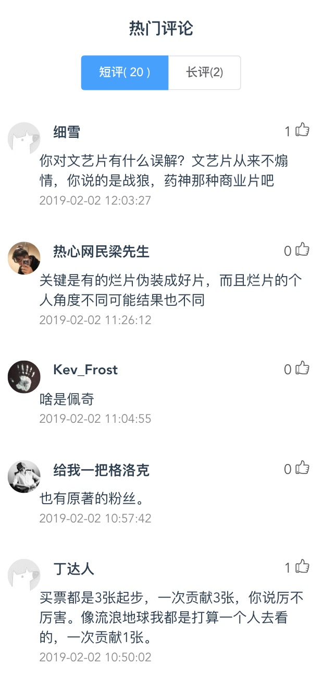

# zhihu-daily-vue

> 使用vuejs编写的知乎日报
## 声明
>『知乎』是 知乎. Inc 的注册商标。本软件与其代码非由知乎创作或维护。软件中所包含的信息与内容皆违反版权与知乎用户协议。本项目所有文字图片等稿件内容均由[知乎](https://www.zhihu.com)提供，获取与共享之行为或有侵犯知乎权益的嫌疑。若被告知需停止共享与使用，本人会及时删除整个项目。请您了解相关情况，并遵守知乎协议。

> 感谢[izzyleung](https://github.com/izzyleung) 整理的 [知乎日报API分析](https://github.com/izzyleung/ZhihuDailyPurify/wiki/%E7%9F%A5%E4%B9%8E%E6%97%A5%E6%8A%A5-API-%E5%88%86%E6%9E%90) 
## 前言
前端时间项目中用到了vuejs,就学了一下，做了个简单点的知乎日报

## 技术栈
vue2 + vue-router + axios + vue-cli + webpack  
element-ui + sass

## 功能
- [x] 新闻列表页
- [x] 查看新闻详情
- [x] 查看评论

## 项目截图
### 首页


### 新闻详情页


### 评论查看页


## Build Setup

``` bash
# install dependencies
npm install

# serve with hot reload at localhost:8080
npm run dev

# build for production with minification
npm run build

# build for production and view the bundle analyzer report
npm run build --report

# run unit tests
npm run unit

# run e2e tests
npm run e2e

# run all tests
npm test
```

For a detailed explanation on how things work, check out the [guide](http://vuejs-templates.github.io/webpack/) and [docs for vue-loader](http://vuejs.github.io/vue-loader).
